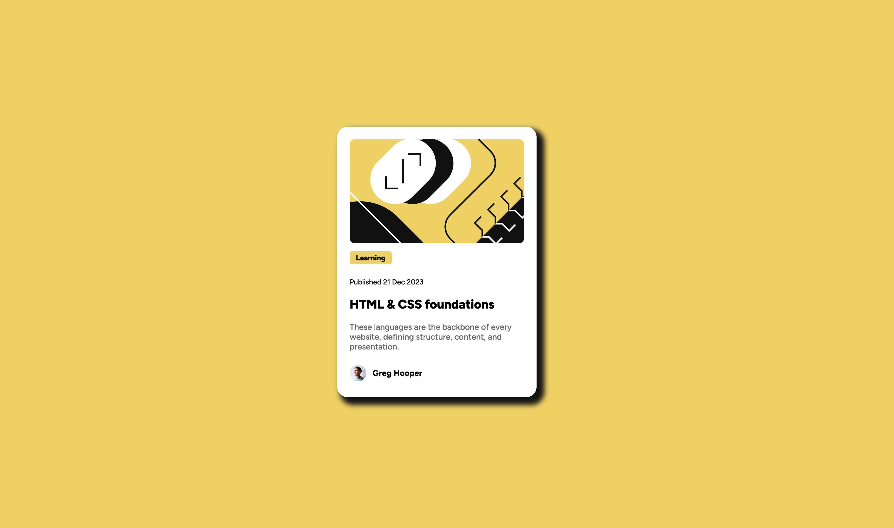

# Frontend Mentor - Blog preview card solution

This is a solution to the [Blog preview card challenge on Frontend Mentor](https://www.frontendmentor.io/challenges/blog-preview-card-ckPaj01IcS). Frontend Mentor challenges help you improve your coding skills by building realistic projects. 

## Table of contents

- [Frontend Mentor - Blog preview card solution](#frontend-mentor---blog-preview-card-solution)
  - [Table of contents](#table-of-contents)
  - [Overview](#overview)
    - [The challenge](#the-challenge)
    - [Screenshot](#screenshot)
    - [Links](#links)
  - [My process](#my-process)
    - [Built with](#built-with)
    - [What I learned](#what-i-learned)
      - [1. Semantic HTML:](#1-semantic-html)
      - [2. CSS Custom Properties:](#2-css-custom-properties)
      - [3. Flexbox:](#3-flexbox)
      - [4. Mobile-first Workflow:](#4-mobile-first-workflow)
      - [5. Using Media Queries:](#5-using-media-queries)
      - [6. Image Alignment:](#6-image-alignment)
    - [Useful resources](#useful-resources)

**Note: Delete this note and update the table of contents based on what **sections** you keep.**

## Overview

### The challenge

Users should be able to:

- See hover and focus states for all interactive elements on the page

### Screenshot



### Links

- Solution URL: [Add solution URL here](https://your-solution-url.com)
- Live Site URL: [Add live site URL here](https://your-live-site-url.com)

## My process

### Built with

- Semantic HTML5 markup
- CSS custom properties
- Flexbox
- Mobile-first workflow

### What I learned

During the development of this project, I learned and reinforced several important skills:

#### 1. Semantic HTML:

- I learned to use semantic HTML tags to improve accessibility and content structure.
- Example:


```html
<article>
  <header>
    <h1>Blog Title</h1>
    <p>Published on <time datetime="2025-03-07">March 7, 2025</time></p>
  </header>
  <p>This is the blog content...</p>
</article>
```
#### 2. CSS Custom Properties:

- I used CSS variables to maintain consistency in styles and make them easier to manage.
- Example:


```css
:root {
  --primary-color: hsl(47, 88%, 63%);
  --secondary-color: hsl(0, 0%, 42%);
}

.button {
  background-color: var(--primary-color);
  color: var(--secondary-color);
}
```
#### 3. Flexbox:
- I learned to use Flexbox to create flexible and responsive layouts.
- Example:

```css
.container {
  display: flex;
  justify-content: center;
  align-items: center;
  min-height: 100vh;
}
```

#### 4. Mobile-first Workflow:

- I adopted a mobile-first design approach, ensuring the design looks good on mobile devices before adapting it to larger screens.
- Example

```css
.card {
  width: 100%;
  max-width: 384px;
  padding: 24px;
}

@media (min-width: 768px) {
  .card {
    max-width: 600px;
  }
}
```

#### 5. Using Media Queries:
- I learned to use media queries to adjust the design for different screen sizes.
- Example:

```css
@media (max-width: 375px) {
  .card-section__header {
    font-size: 20px;
  } 
}
```

#### 6. Image Alignment:

- I learned to align images within containers using Flexbox and other CSS techniques.
- Example:
```css
.card-header__img {
  text-align: center;
  width: 100%;
  height: auto;
  border-radius: 10px;
}

.card-header__img img {
  max-width: 100%;
  height: auto;
}
```

### Useful resources

- [Video Midudev CSS](https://www.youtube.com/watch?v=TlJbu0BMLaY&t=6145s) 
<!-- 
## Author

- Website - [Add your name here](https://www.your-site.com)
- Frontend Mentor - [@yourusername](https://www.frontendmentor.io/profile/yourusername)
- Twitter - [@yourusername](https://www.twitter.com/yourusername) -->

